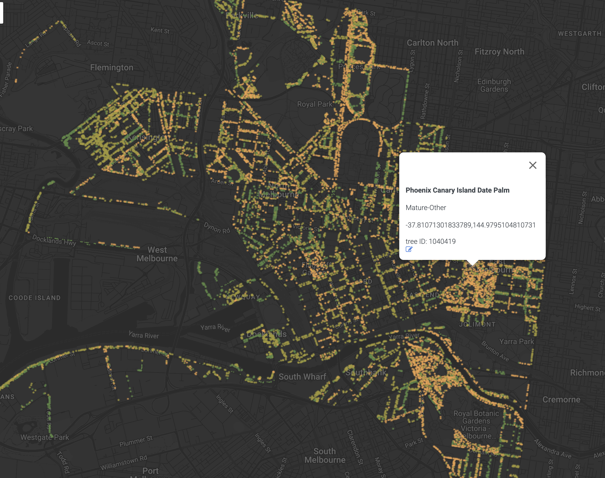
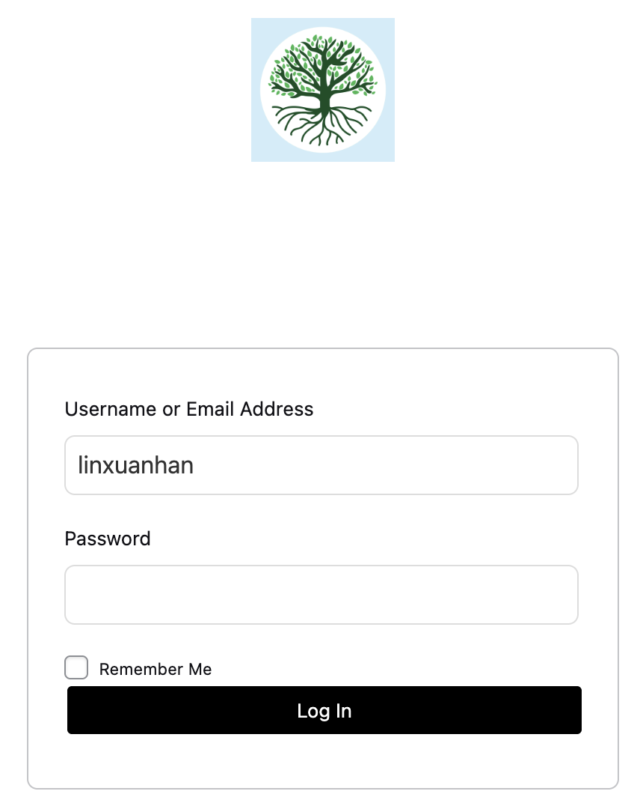

# Sprint Showcase - Assignment 2

## **Sprint Showcase Outcomes for Urban Tree Explorer**

### **Sprint Showcase Outcomes Table**
| **Category** | **Details** |
|-------------|------------|
| **Sprint Goal** | Deliver a functioning MVP of the Urban Tree Explorer with basic interactive map visualization capabilities and secure access control. |
| **Completed Features** | - Tree Location Visualization on Map ✅   - Tree Location Info-Label display ✅    - User Login UI deployment ✅ |
| **Postponed Features** | - 2 FA User authentication (Login/Signup) ❌ 
| **Demo Summary** | - Showed login page (without 2FA authentication)   - Demonstrated functionality of map page  |
| **Stakeholder Feedback** | [Waiting for feedbacks] |
| **Action Items** | [Waiting for feedbacks]|

---

### **Image of Sprint Showcase Outcomes**

<h4 align="center"><b>[Tree Location Visulazation and Label Display]</b></h4>

<h4 align="center"><b>[Login UI]</b></h4>