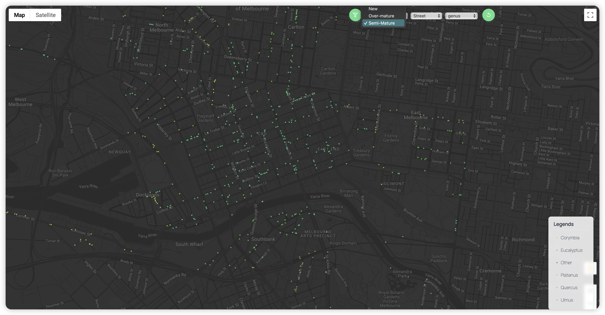
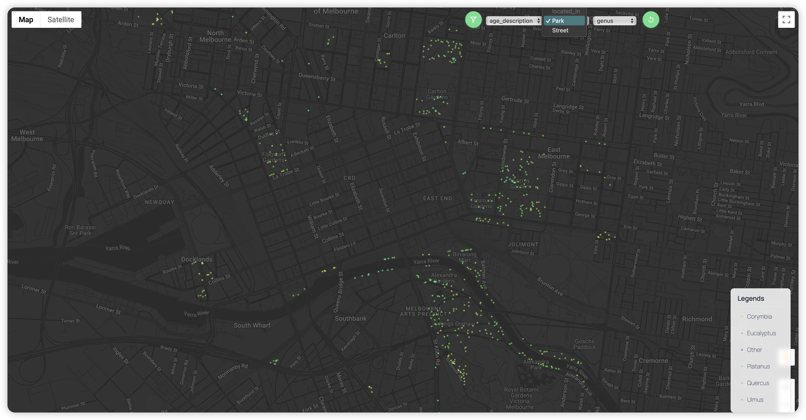
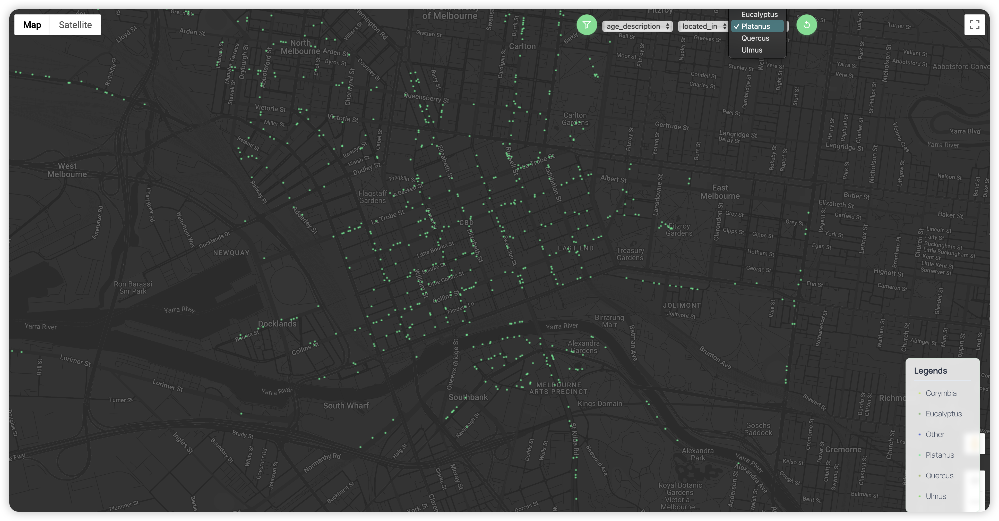
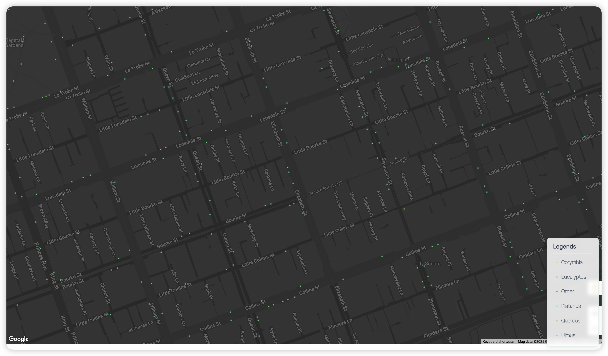
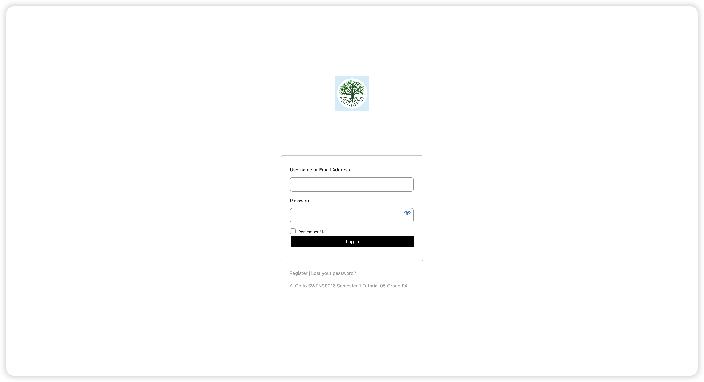

# Sprint Showcase - Assignment 2 (Sprint 2)

## **Sprint Showcase Outcomes for Urban Tree Explorer**

### **Sprint Showcase Outcomes Table**

| **Category**             | **Details**                                                                                                                                                                                                                                                                                                                                                                                                                                                                                           |
| ------------------------ | ----------------------------------------------------------------------------------------------------------------------------------------------------------------------------------------------------------------------------------------------------------------------------------------------------------------------------------------------------------------------------------------------------------------------------------------------------------------------------------------------------- |
| **Sprint Goal**          | Implementing interactive map features with search/filtering capabilities for urban trees and creating a secure login system for user authentication.                                                                                                                                                                                                                                                                                                                                                  |
| **Completed Features**   | - Nearby Tree Search with location and distance parameters ✅   - Tree Category Filtering by location type, genus, and age ✅   - Basic Authentication with login redirect functionality ✅                                                                                                                                                                                                                                                                                                     |
| **Postponed Features**   | None - All planned features were completed successfully ✓                                                                                                                                                                                                                                                                                                                                                                                                                                             |
| **Demo Summary**         | - Demonstrated interactive map showing at least 3000 trees   - Showcased location search with distance parameter and nearest trees list   - Presented category filtering with color coding for genus   - Demonstrated login system with authentication and redirect functionality   - Implemented security measure where unauthorized users attempting to access any page (e.g., https://t05-g04.swen90016-s12025.eng.unimelb.edu.au/map/) are automatically redirected to the login page |
| **Stakeholder Feedback** | [Waiting for feedbacks]                                                                                                                                                                                                                                                                                                                                                                                                                                                                               |
| **Action Items**         | [Waiting for feedbacks]                                                                                                                                                                                                                                                                                                                                                                                                                                                                               |

---

### **Images of Sprint Showcase Outcomes**

<h4 align="center"><b>[Nearby Tree Search with Distance Parameter]</b></h4>

<h4 align="center"><b>[Tree Age Filtering]</b></h4>

<h4 align="center"><b>[Tree Located Filtering]</b></h4>

<h4 align="center"><b>[Tree Category Filtering]</b></h4>

<h4 align="center"><b>[Legend for Tree Colors by Genus]</b></h4>

<h4 align="center"><b>[Login System with Authentication]</b></h4>
