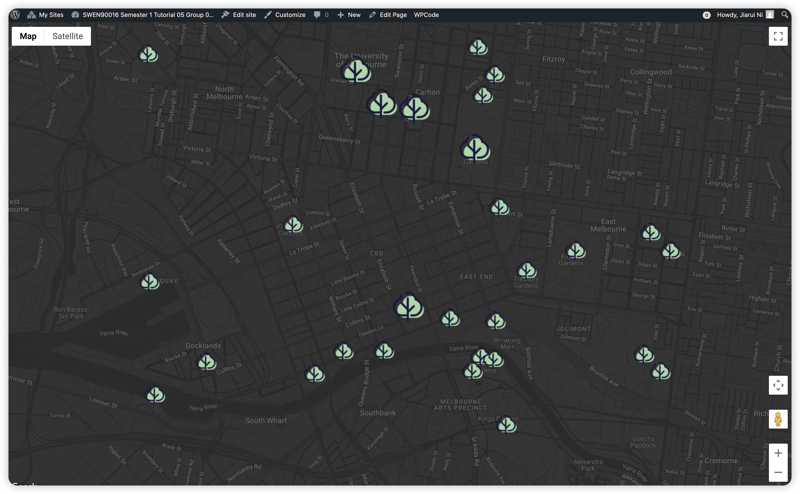
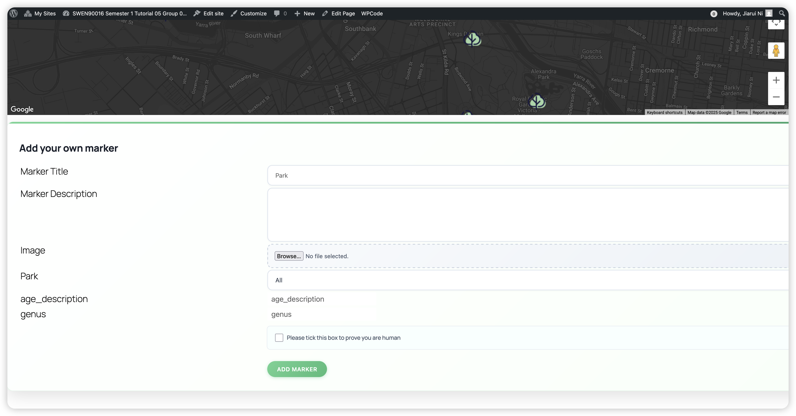
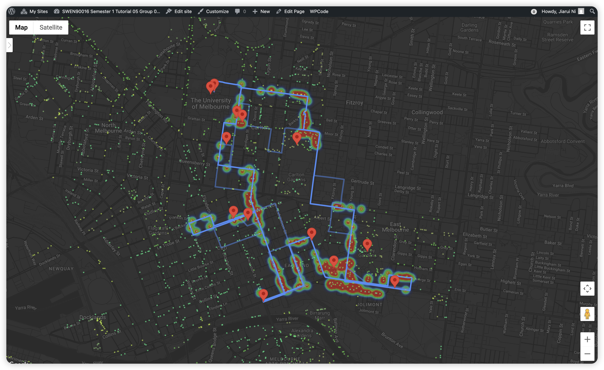
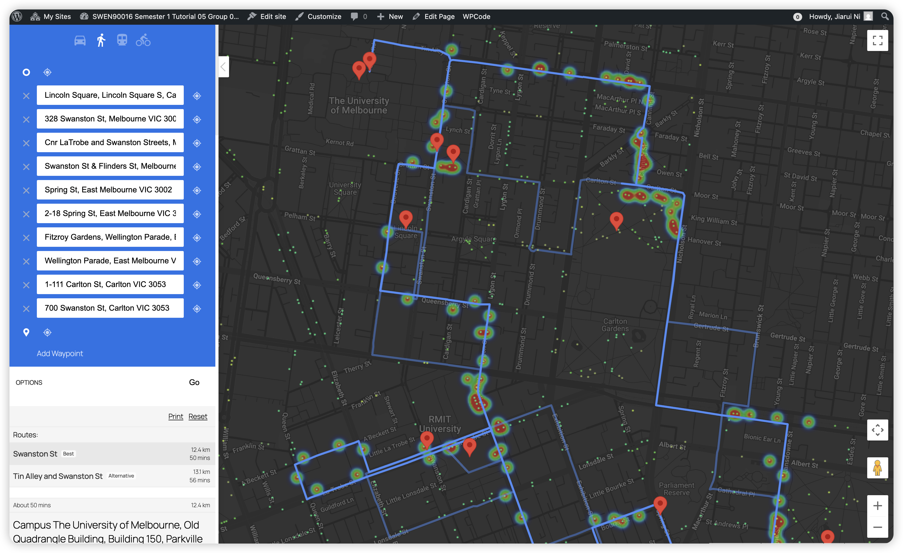
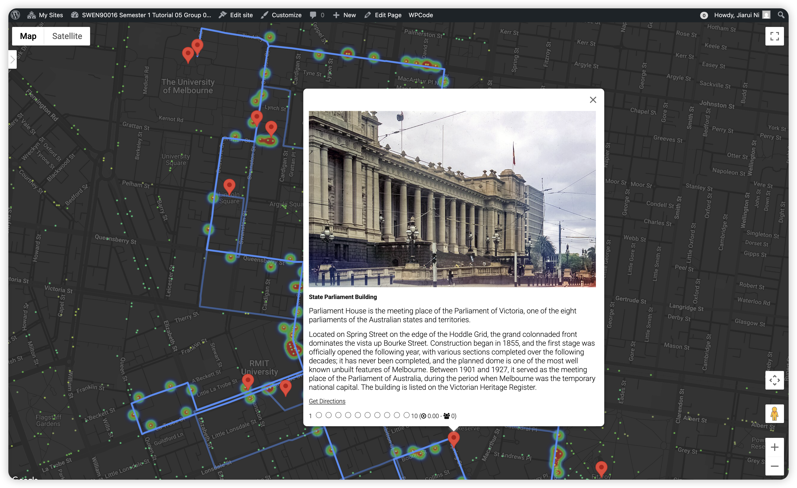

# Sprint Showcase - Assignment 2 (Sprint 3)

## **Sprint Showcase Outcomes for Urban Tree Explorer**

### **Sprint Showcase Outcomes Table**

| **Category**             | **Details**                                                                                                                                                                                                                                                                                                                                                                                                                                                                                                                                                                                                                                                                                                                                                                                                                                                                                                                                                                                                                                                                                                                  |
| ------------------------ | ---------------------------------------------------------------------------------------------------------------------------------------------------------------------------------------------------------------------------------------------------------------------------------------------------------------------------------------------------------------------------------------------------------------------------------------------------------------------------------------------------------------------------------------------------------------------------------------------------------------------------------------------------------------------------------------------------------------------------------------------------------------------------------------------------------------------------------------------------------------------------------------------------------------------------------------------------------------------------------------------------------------------------------------------------------------------------------------------------------------------------- |
| **Sprint Goal**          | Implementing location sharing and recommendations through interactive maps that provide information about park locations and walking itineraries for PhD students around Melbourne CBD and Melbourne Connect.                                                                                                                                                                                                                                                                                                                                                                                                                                                                                                                                                                                                                                                                                                                                                                                                                                                                                                                |
| **Completed Features**   | **Web Page 4 - Interactive Park Map:**   - Interactive map displaying Melbourne park locations near Melbourne Connect ✅   - User rating system (1-10 scale) with average rating display ✅   - User-submitted marker functionality for new parks and places of interest ✅   - Marker categorization and photo upload capabilities ✅   - Filter system for user-submitted markers ✅   - Detailed information for specific locations (University Square, Lincoln Square, Argyle Square, Carlton Gardens) with 3+ photos each ✅   - Embedded YouTube videos for location demonstrations ✅    **Web Page 5 - Walking Itinerary Map:**   - Interactive walking itinerary map with pre-determined route ✅   - Complete route from University of Melbourne Old Quad to Carlton Gardens (11 stops) ✅   - Route navigation and directions display ✅   - User rating system for each stop along the itinerary ✅   - Tree location data integration (3000+ trees) ✅   - Tree heatmap visualization around walking path ✅   - Distinct marker display for itinerary stops ✅ |
| **Postponed Features**   | None - All planned features for both Web Pages were completed successfully ✓                                                                                                                                                                                                                                                                                                                                                                                                                                                                                                                                                                                                                                                                                                                                                                                                                                                                                                                                                                                                                                                 |
| **Demo Summary**         | - Demonstrated interactive park map with Melbourne park locations and user interaction capabilities   - Showcased user rating system and marker submission functionality   - Presented detailed location information with photos and embedded videos   - Demonstrated walking itinerary map with complete route navigation   - Showcased tree heatmap visualization and route planning features   - Presented user rating capabilities for itinerary stops   - Demonstrated filtering and categorization features for enhanced user experience                                                                                                                                                                                                                                                                                                                                                                                                                                                                                                                                                             |
| **Stakeholder Feedback** | [Waiting for feedbacks]                                                                                                                                                                                                                                                                                                                                                                                                                                                                                                                                                                                                                                                                                                                                                                                                                                                                                                                                                                                                                                                                                                      |
| **Action Items**         | [Waiting for feedbacks]                                                                                                                                                                                                                                                                                                                                                                                                                                                                                                                                                                                                                                                                                                                                                                                                                                                                                                                                                                                                                                                                                                      |

---

### **Images of Sprint Showcase Outcomes**

<h4 align="center"><b>[Web Page 4 - Interactive Park Map with Melbourne Locations]</b></h4>

<h4 align="center"><b>[User-Submitted Marker Addition with Category and Photo Upload]</b></h4>

<h4 align="center"><b>[Detailed Park Information with Photos and Descriptions]</b></h4>

<h4 align="center"><b>[Web Page 5 - Walking Itinerary Map with Tree Heatmap]</b></h4>

<h4 align="center"><b>[Detailed Route Navigation with Best and Alternative Routes]</b></h4>

<h4 align="center"><b>[Itinerary Stop Details with User Rating System]</b></h4>
